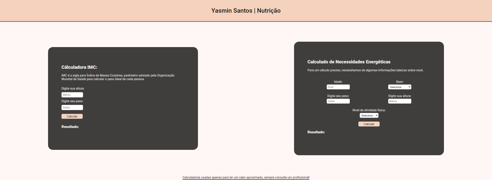

# Calculadoras úteis para Nutrição

O projeto possui uma caluladora de IMC e uma de Gasto Enérgetico para acelerar o processo de calculo de um paciente.

[🔗 Clique aqui para acessar](https://dilanf.github.io/calculadora-nutricao/)

## 🖥️ Tecnologias

-HTML
-CSS
-Javascript
-Git e Github

## 😊 Contato

dilanferrari@hotmail.com